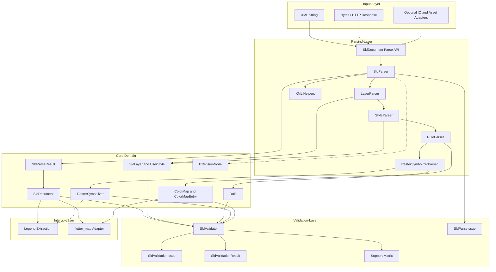
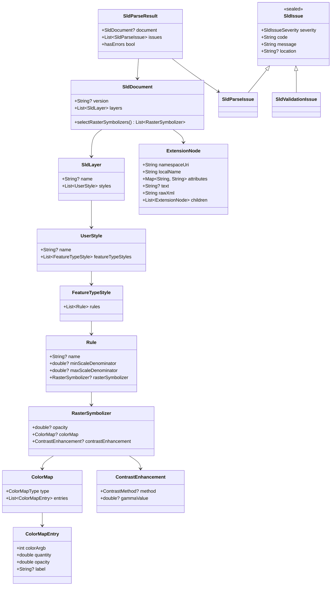

# flutter_map_sld: Architecture

## Architekturziele

Die Architektur soll vier Anforderungen gleichzeitig erfüllen:

- OGC-nahe Modellierung von SLD/SE
- robuste XML-Verarbeitung in Dart
- klare Trennung zwischen Core, Validierung und Flutter-Interop
- kontrollierte Erweiterbarkeit für GeoServer-spezifische Dialekte

Die zentrale Entscheidung ist deshalb:

Der fachliche Kern bleibt framework-unabhängig und enthält keine Flutter-spezifischen Typen.

Zusätzliche Architekturentscheidungen:

- v1 startet mit einem separaten Pure-Dart-Core-Package: `flutter_map_sld`
- I/O- und Flutter-Adapter werden als eigene Pub-Packages aufgebaut:
  - `flutter_map_sld_io`
  - `flutter_map_sld_flutter_map`
- die Repository-Struktur darf monorepo-artig mehrere Packages enthalten, auch wenn zunächst nur der Core veröffentlicht wird
- Parse-Ergebnis und Validierungsergebnis werden getrennt modelliert
- der Core bleibt frei von `dart:io`; Datei- und Asset-Zugriffe werden als optionale Adapter implementiert

## Architekturübersicht

Die Bibliothek wird in Schichten aufgebaut.

1. XML Input
   - Einlesen von XML aus String oder Bytes im Core; Datei-, Asset- und HTTP-Zugriff leben in separaten Adapter-Packages
2. Parsing
   - XML-Knoten in Domain-Objekte und Parse-Diagnostics überführen
3. Domain Model
   - typisierte SLD/SE-Datenstrukturen
4. Validation
   - fachliche und Support-bezogene Prüfungen auf Basis eines erfolgreichen Parse-Ergebnisses
5. Evaluation / Interop
   - Auswahl relevanter Regeln, Ableitung nutzbarer Style-Informationen und Legendendaten
6. Flutter / `flutter_map` Adapter
   - projektspezifische oder engine-spezifische Weiterverwendung

## System-Architektur



## Komponenten-Übersicht

### 1. Input-Layer

- XML als String aus Assets, Datenbank oder eingebettetem Konfigurationsmaterial
- Byte-basierte Eingaben für lokale und entfernte SLD-Dokumente
- separate Adapter-Packages für Datei, Asset-Bundle oder HTTP-Client
- perspektivisch HTTP-Responses aus WMS-/Catalog-Workflows, aber nicht im Core-v1

### 2. Parsing-Layer

| Komponente | Zweck | Verwendung |
|------------|-------|------------|
| `SldDocument.parse*` | öffentliche Core-Einstiegspunkte | String oder Bytes einlesen |
| `SldIo` | optionale I/O-Helfer in eigenem Package | Datei oder HTTP außerhalb des Core; Flutter-Assets im Flutter-Package |
| `SldParser` | zentrale Orchestrierung | XML-Dokument analysieren und Modell aufbauen |
| `LayerParser` | Layer-Strukturen | `NamedLayer`, `UserLayer` |
| `StyleParser` | Style-Strukturen | `UserStyle`, `FeatureTypeStyle` |
| `RuleParser` | Regeln und Maßstäbe | `Rule`, Skalengrenzen, spätere Filter |
| `RasterSymbolizerParser` | Rasterstyling | `Opacity`, `ColorMap`, `ContrastEnhancement` |
| `xml_helpers` | Namespace- und Knotenlogik | wiederverwendbare XML-Helfer |

### 3. Domain-Layer

- typisierte Repräsentation von SLD/SE-Strukturen
- Fokus auf stabilen Dart-Typen statt direkter XML-Nutzung in höheren Schichten
- Erweiterungspunkte für unbekannte oder vendor-spezifische Knoten

### 4. Validation-Layer

- trennt tolerantes Parsing von belastbarer Fachprüfung
- liefert strukturierte Issues statt impliziter Fehlerzustände
- bildet die Basis für eine dokumentierte Support-Matrix

### 5. Interop-Layer

- exportiert nutzbare Style-Informationen aus dem Core-Modell
- erzeugt Hilfsstrukturen für Legenden, Farbskalen und spätere Adapter
- erlaubt bewusst partielle Unterstützung statt all-or-nothing Rendering

## Schichten im Detail

### 1. XML Input

Verantwortung:

- XML laden
- Namespaces normalisieren
- Encoding-Probleme abfangen

Fehlerbehandlung:

Fehler im Core-Input-Layer werden als `SldParseIssue` im `SldParseResult` gemeldet, nicht als Exception. Dadurch bleibt die API einheitlich und der Aufrufer muss nur einen Fehlerkanal prüfen. Exceptions werden nur bei Programmierfehlern (z.B. `null`-Argumente) geworfen, nicht bei fehlerhaftem XML-Input.

Transportfehler in Adapter-Packages sind davon getrennt. Ein optionales Package wie `flutter_map_sld_io` soll Datei-, Netzwerk- oder HTTP-Fehler nicht in `SldParseIssue` umbiegen, sondern als eigenen Load-Fehlerkanal modellieren.

- Ungültiges XML (Syntax-Fehler): `SldParseIssue` mit Severity `error`, `document` ist `null`
- Unbekanntes Encoding: `SldParseIssue` mit Severity `error`
- Fehlender Root-Namespace: `SldParseIssue` mit Severity `warning`, Parsing versucht Fallback

Vorgesehene API:

```dart
final result = SldDocument.parseXmlString(xml);
final result = SldDocument.parseBytes(bytes);

// Optionaler Adapter in `flutter_map_sld_io`:
final result = await SldIo.parseFile(path);
```

Technische Empfehlung:

- Dart-Package `xml` für DOM-basierte Verarbeitung
- keine Flutter-Abhängigkeit in dieser Schicht
- keine Pflichtabhängigkeit auf `dart:io` im Core

### 2. Parser

Verantwortung:

- XML in typsichere Modelle transformieren
- Namespaces und Versionsvarianten behandeln
- GeoServer-Erweiterungen explizit markieren

Wichtige Parser-Bausteine:

- `SldParser`
- `LayerParser`
- `StyleParser`
- `RuleParser`
- `RasterSymbolizerParser`
- später: `VectorSymbolizerParser`, `FilterParser`, `ExpressionParser`

Parser-Regeln:

- unbekannte Elemente nicht sofort verlieren, sondern als `extensions` oder `unsupportedNodes` erfassen
- Fehler mit Pfad- und Kontextinformation zurückgeben
- Parser und Validierung nicht vermischen

Vorgeschlagenes Parse-Ergebnis:

```dart
/// Gemeinsame Basis für alle Issues (Dart 3 sealed class).
///
/// [location] ist kontextabhängig:
/// - In [SldParseIssue]: XPath-ähnlicher Pfad zum betroffenen XML-Knoten
///   (z.B. "/StyledLayerDescriptor/NamedLayer[1]/UserStyle/…/ColorMap")
/// - In [SldValidationIssue]: Modellpfad zum betroffenen Domain-Objekt
///   (z.B. "layers[0].styles[0].featureTypeStyles[0].rules[0].rasterSymbolizer.colorMap")
sealed class SldIssue {
  final SldIssueSeverity severity;
  final String code;
  final String message;
  final String? location;
}

class SldParseIssue extends SldIssue {}

class SldValidationIssue extends SldIssue {}

class SldParseResult {
  final SldDocument? document;
  final List<SldParseIssue> issues;

  bool get hasErrors;
}
```

### 3. Domain Model

Das Domain Model ist das Herz der Bibliothek.

Beispielhafte Kernobjekte:

```dart
class SldDocument {
  final String? version;
  final List<SldLayer> layers;
}

class RasterSymbolizer {
  final double? opacity;
  final ColorMap? colorMap;
  final ContrastEnhancement? contrastEnhancement;
}

class ColorMap {
  final ColorMapType type;
  final List<ColorMapEntry> entries;
}

class ColorMapEntry {
  final int colorArgb;
  final double quantity;
  final double opacity;
  final String? label;
}
```

Designprinzipien:

- immutable Datenstrukturen
- null nur für fachlich optionale Felder
- Enumerationen statt freier Strings, wo sinnvoll
- rohe XML-Erweiterungen separat halten

## Kern-Klassenbild



### 4. Validation

Validierung ist ein eigener Layer, damit Parsing tolerant und Nutzung belastbar bleibt.

Prüfarten:

- Pflichtfelder fehlen
- Wertebereiche ungültig
- semantische Konflikte
- nicht unterstützte, aber erkannte Elemente

Beispiele:

- `Opacity` muss zwischen `0.0` und `1.0` liegen
- `ColorMap` braucht mindestens einen Eintrag
- `quantity`-Werte sollten sortierbar und fachlich konsistent sein
- `ColorMap type="intervals"` wird als GeoServer-/erweiterter Support markiert
- unbekannte Vendor-Teilbäume dürfen strukturell erhalten bleiben, auch wenn sie fachlich als `vendorExtension` klassifiziert werden

Fehlermodell:

```dart
class SldValidationResult {
  final List<SldValidationIssue> issues;

  bool get hasErrors;
}

// SldValidationIssue erbt von SldIssue (siehe sealed class oben).
```

Vorgesehene Nutzung:

```dart
final parseResult = SldDocument.parseXmlString(xml);
if (parseResult.hasErrors || parseResult.document == null) {
  return;
}

final validation = SldValidator().validate(parseResult.document!);
```

### 5. Evaluation / Interop

Dieser Layer übersetzt das rohe Domain-Modell in nutzbare Laufzeitinformationen.

Beispiele:

- aktive Regeln anhand von Maßstab oder Filter selektieren
- Raster-ColorMap in eine Dart-kompatible Farbskala überführen
- Legendeninformationen extrahieren

Wichtig:

Nicht jede SLD-Regel muss direkt clientseitig gerendert werden. Der Interop-Layer darf bewusst Teilmengen exportieren.
Für v1 ist der Interop-Layer auf Legendendaten, Farbskalen und selektierbare Raster-Informationen begrenzt. WMS-Request-Helfer kommen erst nach einem stabilen Core und nur bei nachgewiesenem Bedarf hinzu.

### 6. Flutter / `flutter_map` Adapter

Diese Schicht ist optional und hängt vom Reifegrad des Projekts ab.

Aufgaben:

- Abbildung des Core-Modells auf `flutter_map`-nahe Datentypen
- Hilfen für WMS-Layer-Konfiguration
- Legenden-Widgets oder Vorschaukomponenten

Wichtige architektonische Grenze:

`flutter_map` sollte nicht in den Parser-Core gezogen werden. Stattdessen konsumiert der Adapter das Core-Modell.

## Empfohlene Paketstruktur

```text
packages/
  flutter_map_sld/
    lib/
      flutter_map_sld.dart
      src/
        parser/
          sld_parser.dart
          xml_helpers.dart
          parsers/
            layer_parser.dart
            style_parser.dart
            rule_parser.dart
            raster_symbolizer_parser.dart
        model/
          sld_document.dart
          layer.dart
          style.dart
          rule.dart
          raster_symbolizer.dart
          color_map.dart
          contrast_enhancement.dart
          extension_node.dart
          issue.dart
          parse_issue.dart
        validation/
          validator.dart
          validation_result.dart
          validation_issue.dart
          rules/
            raster_rules.dart
            color_map_rules.dart
        interop/
          legend/
            legend_model.dart
  flutter_map_sld_io/
    lib/
      flutter_map_sld_io.dart
      src/
        sld_io.dart
  flutter_map_sld_flutter_map/
    lib/
      flutter_map_sld_flutter_map.dart
      src/
        flutter_map_style_adapter.dart
```

## Rendering- und Feature-Strategie

Für den Start sollte die Architektur nicht auf vollständiges Client-Rendering ausgelegt werden, sondern auf sichere Interpretation.

Empfohlene Reihenfolge:

1. Parse-only
2. Validate-and-inspect
3. Raster-style export und Legendendaten
4. `flutter_map` helpers im Adapter-Package
5. ausgewählte Client-Rendering-Funktionen oder WMS-Helfer nur bei echtem Bedarf

Das reduziert Risiko und hält die Bibliothek nützlich, bevor komplexe Renderpfade gebaut werden.
Die mittelfristige Planungsannahme lautet: Metadaten-Export hat Priorität; clientseitige Rasterdarstellung ist ein optionales Folgeprojekt und nicht Teil der Basisarchitektur.

## Support-Matrix

Die Bibliothek sollte jedes Feature in einer klaren Kategorie führen:

- `supported`
- `partiallySupported`
- `parsedButIgnored`
- `unsupported`
- `vendorExtension`

Das ist wichtig, weil SLD/SE in der Praxis selten vollständig homogen implementiert wird.

## Design-Patterns

### Layered Architecture

- trennt Input, Parsing, Domain, Validierung und Interop sauber
- reduziert Kopplung zwischen XML-Verarbeitung und Flutter-spezifischer Nutzung
- macht spätere Erweiterungen auf Vektor-Symbolizer kontrollierbar

### Parser Composition

- statt eines monolithischen Parsers werden fachliche Parser pro Struktur eingesetzt
- erleichtert Tests auf Fragmentebene
- erlaubt spätere Erweiterung um `FilterParser`, `ExpressionParser` und weitere Symbolizer

### Adapter Pattern

- `flutter_map`-Integration konsumiert das Core-Modell, verändert es aber nicht
- dieselbe Core-Repräsentation kann später auch für andere Dart- oder Server-Adapter genutzt werden

### Tolerant Reader

- unbekannte XML-Inhalte werden möglichst konserviert statt früh verworfen
- realistische GeoServer-Dateien bleiben damit analysierbar, auch wenn einzelne Features noch nicht unterstützt sind

## Raster-first Architektur

Weil die ersten Referenzfälle aus dem GeoServer-Raster-Cookbook kommen, sollte `RasterSymbolizer` zuerst vollständig modelliert werden.

V1-Raster-Fokus:

- `Opacity`
- `ColorMap`
- `ColorMapEntry`
- `ContrastEnhancement`
- GeoServer-`ColorMap type`

Später:

- `ChannelSelection`
- `ShadedRelief`
- Mehrband-Raster
- serverabhängige Spezialfälle

## Erweiterbarkeit für Vendor Extensions

GeoServer und andere Server nutzen teilweise Elemente oder Attribute außerhalb des harten OGC-Kerns.

Dafür sollte das Modell Erweiterungspunkte haben:

```dart
class ExtensionNode {
  final String namespaceUri;
  final String localName;
  final Map<String, String> attributes;
  final String? text;
  final String rawXml;
  final List<ExtensionNode> children;
}
```

Nutzen:

- unbekannte Inhalte gehen nicht verloren
- zukünftige Features können ohne Parser-Bruch ergänzt werden
- Debugging realer SLD-Dateien wird einfacher

Die Entscheidung ist: unbekannte XML-Teilbäume werden vollständig konserviert. Dazu enthält `ExtensionNode` neben Metadaten auch `children` und `rawXml`, sodass sowohl strukturierter Zugriff als auch spätere Diagnose möglich bleiben.

## Teststrategie

Es werden drei Testebenen benötigt:

1. Parser-Tests
   - einzelne XML-Fragmente
2. Golden-Style-Tests
   - echte SLD-Dateien aus GeoServer-Beispielen
3. Interop-Tests
   - abgeleitete Dart-Modelle und Legendendaten

Pflicht-Testfälle für v1:

- Zwei-Farb-Verlauf
- Transparenter Verlauf
- Alpha-Kanal
- Drei-Farb-Verlauf
- diskrete Intervalle
- invalide `opacity`
- fehlende `ColorMapEntry`
- SLD 1.0 und SE/SLD 1.1 Namespace-Varianten
- `sld:`- und `se:`-präfixbasierte Dokumente
- unbekannte Vendor-Extensions bleiben im Modell erhalten
- Parse-Fehler und Validation-Issues werden getrennt berichtet
- Core-Package bleibt ohne `dart:io`, Flutter und `flutter_map`

## Dependency-Management

| Abhängigkeit | Rolle | Einbindung |
|-------------|-------|------------|
| `xml` (pub.dev) | DOM-basierte XML-Verarbeitung | reguläre Dependency im Core-Package |
| `flutter_map` | Kartenadapter | reguläre Dependency nur im Package `flutter_map_sld_flutter_map` |
| `http` / `dio` | HTTP-basierter SLD-Abruf | reguläre Dependency nur im Package `flutter_map_sld_io` |
| Flutter SDK | Widget-Layer | nur im Package `flutter_map_sld_flutter_map`, nicht im Core |

Versionsstrategie:

- Minimale Dart-SDK-Version: `>=3.0.0` (für sealed classes und records)
- `xml`-Package: kompatibel mit aktueller Stable, Minimum-Version in `pubspec.yaml` pinnen
- `flutter_map_sld_flutter_map`: definiert eine normale kompatible Versionsrange auf `flutter_map`
- Adapter-Packages folgen der Core-Version als Minimum-Constraint und können unabhängig Patch-Releases erhalten

## Technische Entscheidungen

- Sprache: Dart
- Core: pure Dart
- Flutter nur in optionalen Adaptern
- XML-Verarbeitung: DOM-basiert für Korrektheit und Nachvollziehbarkeit
- öffentliche API klein halten, interne Parser modular

## Empfehlung

Für ein sauberes Fundament sollte das erste Inkrement als standardnaher, reiner Dart-Core mit raster-orientiertem MVP gebaut werden. `flutter_map`- und I/O-Integration setzen darauf auf, werden aber als getrennte Adapter-Packages publiziert, damit der Core technisch und semantisch sauber bleibt.

## Referenzen

- GeoServer Raster Cookbook: https://docs.geoserver.org/stable/en/user/styling/sld/cookbook/rasters.html
- OGC Symbology Encoding: https://www.ogc.org/standards/se/
- OGC Styled Layer Descriptor: https://www.ogc.org/standards/sld/
